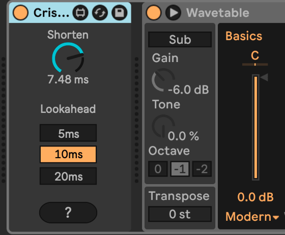

# Crisco Note Shortening

Crisco Note Shortening is a Max for Live MIDI device that allows you to fine-tune the length of MIDI notes in a track in real time.

In order to shorten notes, some degree of latency is required since we do not know the note length ahead of time. The amount of latency is selectable between 5ms, 10ms, and 20ms.

Thanks to *Marlon* for suggesting the device and helping me understand its value. Marlon makes Psytrance, where precise note-offs are an important part of the genre and micro editing all the notes in a track is tedious. Crisco trades latency for convenience in that regard.

## Installation

[Download the newest release](https://plugins.steinkamp.us/m4l-Crisco) or clone this repository, and drag the `CriscoNoteShortening.amxd` device into a track in Ableton Live.

## Changelog

- 2025-01-12 [v1](https://github.com/zsteinkamp/m4l-Crisco/releases/download/v1/CriscoNoteShortening-v1.amxd) - Initial Release.

## Usage

1) Add this device to a MIDI track.
2) Dial in a shortening amount. Choose a latency value as low as possible to facilitate the shortening amount. Shortening always hasto be equal to or less than the latency.
3) ...
4) Profit!

## TODO

- ...
